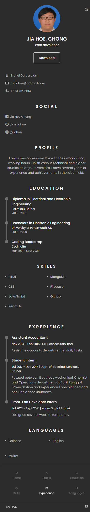
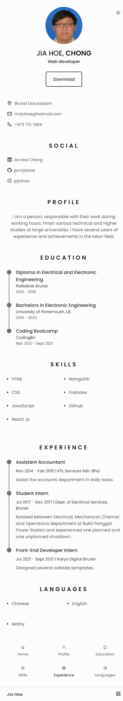
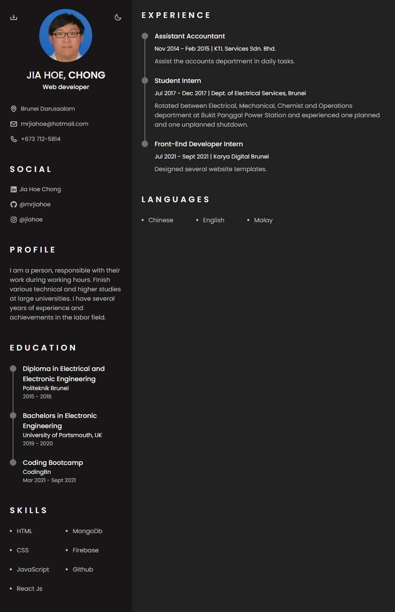
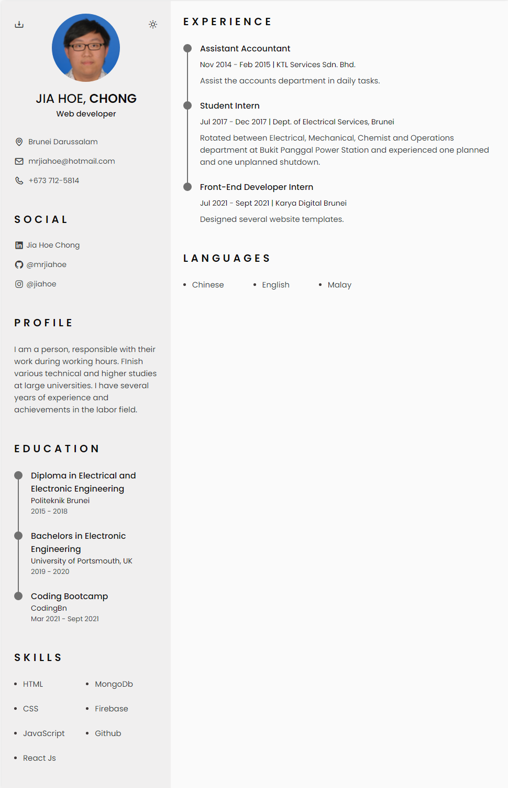

# Responsive Resume Cv using HTML, CSS, & Javascript w/ light/dark theme

## Done following tutorial from [Bedimcode YouTube](https://www.youtube.com/watch?v=oYjseP_Qhv4)
## Deployed at https://mrjiahoe.github.io/html-resume-light-dark-tutorial/

    
    
    
    

